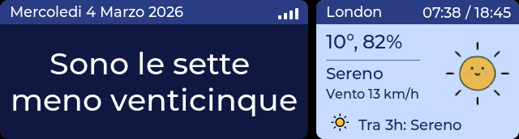
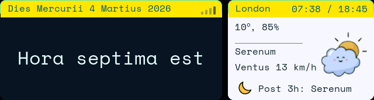
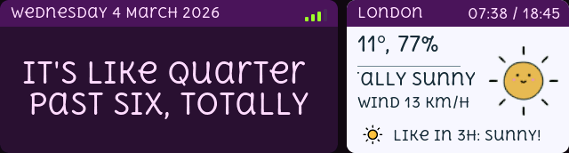
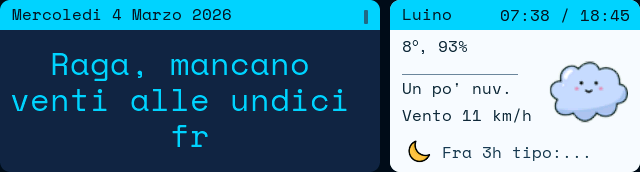
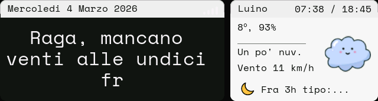
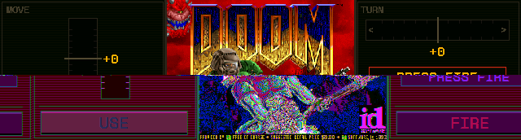
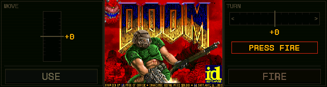
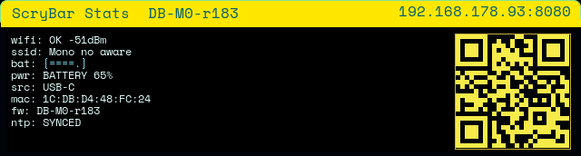

# ScryBar

[](https://arduino.cc/)
[](https://www.espressif.com/)
[](https://lvgl.io/)
[](#word-clock-languages)
[](#views)
[](./LICENSE)

## Theme Previews (HOME + Weather)

| ScryBar Default | Cyberpunk 2077 | Toxic Candy | Tokyo Transit | Minimal Brutalist Mono |
|---|---|---|---|---|
|  |  |  |  |  |

> Yes, that is cyberpunk in Latin. If you want neon UI saying *Hora septima est*, ScryBar will not judge.

> It tells time in thirteen languages, checks weather you could learn by opening a window, scrolls news you've already read, browses Wikipedia for trivia nobody asked for, and runs DOOM — because apparently an ESP32 on your desk wasn't doing enough already.

**ScryBar** is an open-source ESP32-S3 desk companion. One 3.49" touchscreen, five swipeable views, a word clock that composes real sentences in thirteen languages — from Italian and Latin to Klingon, 1337 Speak, and Bellazio — actual grammar, not uppercase tiles — plus RSS feeds, a Wikipedia viewer, a full DOOM port with gyro controls, and a LAN web config UI.

*Why "ScryBar"?* — Part [scry](https://en.wikipedia.org/wiki/Scrying) (gazing into a surface to see things you shouldn't), part *scribe* (it writes sentences, not just numbers), part *bar* (look at it — it's a bar). A 640×172 strip that tells time in Klingon, fetches weather from an API you could just open yourself, scrolls headlines you already read on your phone, pulls random Wikipedia facts nobody asked for, and opens a portal to Hell. On your desk. Between the coffee mug and the cable spaghetti. If that's not scrying, nothing is.

## DOOM on ScryBar

<table><tr>
<td width="55%"></td>
<td>

**Yes, it runs DOOM.**

Native `prboom` on a desk bar. Gyroscope controls — tilt forward to charge, sideways to turn. Dark olive CRT-scanline HUD with oversized tilt meters, because when you're dodging fireballs on a 3.49" strip, subtlety is not a virtue.

Tap **FIRE** on the title screen. The bar does the rest.

</td>
</tr></table>

## Live Views

<table><tr>
<td width="55%"></td>
<td>

**HOME** — The default view. A word clock that writes real sentences, not just numbers on a grid. Weather pulled live from OpenWeatherMap. Thirteen languages, five themes, all switchable from the web UI without reflashing. The display you leave on when nobody's playing DOOM.

</td>
</tr></table>

<table><tr>
<td width="55%"></td>
<td>

**INFO** — The nervous system, exposed. Wi-Fi signal, IP, MAC, battery level, firmware tag, NTP sync. The QR code points to the web config UI — scan it from your phone and you're in. Swipe right to get back to the interesting stuff.

</td>
</tr></table>

---

## Table of Contents

- [Hardware](#hardware)
- [Views](#views)
- [DOOM View](#doom-view)
- [Word Clock Languages](#word-clock-languages)
- [How It Works](#how-it-works)
- [Quick Start](#quick-start)
- [Secrets](#secrets)
- [Feature Toggles](#feature-toggles)
- [Web Config (LAN)](#web-config-lan)
- [Serial Command Reference](#serial-command-reference)
- [Screenshot Workflow](#screenshot-workflow)
- [Security](#security)
- [Archive](#archive)
- [Acknowledgments](#acknowledgments)
- [Open Source Spirit](#open-source-spirit)
- [License](#license)

---

## Hardware

| Component | Spec | Role |
|---|---|---|
| **MCU** | ESP32-S3, 240 MHz, dual-core | The brain. 16 MB flash, OPI PSRAM in octal mode — because LVGL needs room to think. |
| **Board** | Waveshare ESP32-S3-Touch-LCD-3.49 | The whole stack in one unit: display, touch controller, IMU, power management, battery connector. |
| **Display** | AXS15231B, 3.49", 640×172 | The face. Horizontal strip format. `LV_COLOR_16_SWAP=1` because it expects RGB565 big-endian and is not open to discussion about this. |
| **Touch** | AXS15231B integrated | Single-point touch. Carefully filtered for ghost frames and sentinel coordinates. |
| **IMU** | QMI8658 6-axis | Accelerometer + gyroscope. Tilt-to-move in DOOM, shake detection elsewhere. The bar knows when you're angry. |
| **Power** | USB-C + optional LiPo | Charging and battery fallback managed via TCA9554 GPIO expander. Always re-asserted at boot. |

The physical profile: a horizontal bar that sits flat on your desk. Wide enough to host five modes of mischief. Narrow enough that it stops pretending to be a monitor and commits to being furniture that has opinions.

---

## Views

Five views, navigated by swipe.

```
  INFO ◄─► HOME ◄─► AUX (RSS) ◄─► WIKI ◄─► DOOM
```

**HOME** — Word clock in natural sentence form (13 languages), weather icon, temperature, humidity. Theme-driven typography with auto-fit sizing. Switches between themes via the web UI without reflashing.

**AUX** — RSS feed rotation with up to 5 configurable sources. `SKIP`/`NXT`/`QR` controls. Every headline gets a live QR code — because sometimes you want to read the full article on a real screen, and that's fine. We don't judge.

**WIKI** — Wikipedia stream: Featured Article, On This Day, and Random Article. Language is independently selectable (8 real languages) from the system language via web UI. Same `SKIP`/`NXT`/`QR` controls as AUX. A bottomless pit of trivia that you didn't need but now can't stop reading.

**DOOM** — `prboom-go` donor port adapted for ScryBar. Centered 4:3 live framebuffer on the 640×172 strip, "Bunker Console" side HUD with oversized tilt meters, IMU gyroscope controls, and touch bands for `USE` / `FIRE`. Tap FIRE on the title screen to boot the engine. Tilt forward to move, tilt sideways to turn. [Details below.](#doom-view)

**INFO** — System diagnostics: Wi-Fi status, RSSI, IP, MAC, battery level, power source, firmware build tag, NTP sync status. QR code pointing to the web config UI. The nervous system, exposed.

Physical buttons:

- `PWR` (center): short press toggles screensaver (debounced against false micro-presses).
- `BOOT` (left): single click jumps to `HOME`.
- `RST` (right): hardware reset. The nuclear option.

Auto-idle screensaver: `2h` on both USB and battery.

## DOOM View

The DOOM integration intentionally does **not** import all of `retro-go`. ScryBar vendors only the `prboom-go` core under `src/doom/prboom/` plus a local runtime shim. No emulation layers. No LVGL widgets. Direct framebuffer writes to the display controller.

**HUD: "Bunker Console"** — Dark olive-black CRT scanline aesthetic with DOOM-authentic color palette: toxic green for movement, red for combat, amber for readouts. The side meters are deliberately oversized (36×100px vertical, 178×26px horizontal) because when you're dodging imps on a desk bar, you need to see that tilt indicator from across the room.

- Donor baseline: `ducalex/retro-go` → `prboom-go` only
- Render path: direct framebuffer blit, bypasses LVGL entirely
- Live frame: `320×200` source → centered `229×172` 4:3 pillarbox
- Touch zones:
  - Left band = `USE` (doors, switches, elevators — the polite button)
  - Right band = `FIRE` (the other one)
  - Center tap = recenter IMU neutral point
  - Swipe left = exit DOOM and return to WIKI
- IMU (QMI8658):
  - Active only inside DOOM — the rest of the UI ignores tilt
  - Neutral orientation captured after a short stable settle window on entry
  - Forward/backward tilt → move/retreat
  - Left/right tilt → turn

Boot flow: entering DOOM shows the title screen with live tilt meters. Tap `FIRE` to start the engine. This is deliberate — it gives you a moment to find a comfortable tilt angle before you're in a room full of demons.

---

## Word Clock Languages

13 languages, all selectable from the web UI without reflashing. Setting persists to NVS.

**Creative & Constructed:**

| Code | Language | Example (3:15) |
|---|---|---|
| `bellazio` | Bellazio | *Raga, le tre e un quarto. For real.* |
| `val` | Valley Girl | *It's like quarter past three, totally* |
| `l33t` | 1337 Speak | *1T'5 QU4R73R P457 7HR33* |
| `sha` | Shakespearean English | *Verily, 'tis quarter past three* |
| `eo` | Esperanto | *estas kvarono post la tri* |
| `la` | Latina | *hora tertia et quadrans* |
| `tlh` | tlhIngan Hol (Klingon) | *wej rep wa'maH vagh tup* |

**Modern Languages:**

| Code | Language | Example (3:15) |
|---|---|---|
| `en` | English | *it's quarter past three* |
| `it` | Italiano *(default)* | *sono le tre e un quarto* |
| `es` | Español | *son las tres y cuarto* |
| `fr` | Français | *il est trois heures et quart* |
| `de` | Deutsch | *es ist viertel nach drei* |
| `pt` | Português | *são três e quinze* |

Adding a language means writing 4 functions (word clock, weather short, weather label, date format) plus a `UiStrings` block and updating the dispatchers. The framework does the rest. If you can conjugate verbs, you can add a language.

---

## How It Works

At boot: assert SYS_EN via TCA9554, cycle Wi-Fi SSIDs (or use preferred SSID), fall back to setup AP if no known network, sync NTP, render HOME.

Serial `[SUMMARY]` every 30s: build tag, Wi-Fi, NTP, UI page, weather state. Read it like a flight data recorder.

Touch passes through anti-ghost filtering (AXS15231B produces spurious frames at idle — the controller has opinions about how often it wants to be touched).

---

## Quick Start

**Prerequisites:** `arduino-cli`, `esp32` board package by Espressif, libraries listed in `firmware_readme.md`.

### Compile

```bash
arduino-cli compile --clean \
  --build-path /tmp/arduino-build-scrybar \
  --fqbn esp32:esp32:esp32s3:UploadSpeed=921600,USBMode=hwcdc,CDCOnBoot=cdc,CPUFreq=240,FlashMode=qio,FlashSize=16M,PartitionScheme=custom,PSRAM=opi \
  .
```

### Upload

```bash
arduino-cli upload -p <PORT> \
  --fqbn esp32:esp32:esp32s3:UploadSpeed=921600,USBMode=hwcdc,CDCOnBoot=cdc,CPUFreq=240,FlashMode=qio,FlashSize=16M,PartitionScheme=custom,PSRAM=opi \
  --input-dir /tmp/arduino-build-scrybar \
  .
```

This repo ships a checked-in `partitions.csv` and uses `PartitionScheme=custom` — the standard presets ran out of room around the time DOOM moved in.

If upload hangs on `Connecting...`, enter boot mode: hold `BOOT`, press and release `RST`, release `BOOT`. This is not a bug. It is a handshake.

Open Serial Monitor at **115200 baud**. You will see the boot banner, chip diagnostics, and — if `TEST_WIFI=1` — a connection attempt cycling through every configured SSID in sequence.

---

## Secrets

`secrets.h` is local-only and git-ignored. It holds Wi-Fi credentials and API keys.

```bash
cp secrets.h.example secrets.h
# fill in your credentials
```

`secrets.h.example` is committed and contains placeholders only (`<WIFI_SSID>`, `<API_KEY>`, etc.). Never put credentials in `config.h` or any versioned file. The `.gitignore` handles this by design, not accident.

---

## Feature Toggles

Enable or disable subsystems in `config.h`. Nothing is compiled in unless explicitly toggled on.

| Toggle | What it activates |
|---|---|
| `TEST_SERIAL_INFO` | Chip, heap, flash diagnostics at boot |
| `TEST_BACKLIGHT` | Display backlight PWM test |
| `TEST_I2C_SCAN` | I2C bus scan, prints found addresses |
| `TEST_DISPLAY` | Display init via AXS15231B (Arduino_GFX) |
| `TEST_IMU` | QMI8658 accelerometer + gyroscope (required for DOOM tilt controls) |
| `TEST_WIFI` | STA connection with multi-SSID retry |
| `TEST_NTP` | NTP sync, prints `local_time=...` |
| `TEST_BATTERY` | Battery monitoring via ADC (voltage, charge level, power source) |
| `DOOM_SPIKE_ENABLED` | DOOM page + prboom donor runtime |
| `TEST_TOUCH` | **Required for swipe navigation.** Boot log shows `[SKIP] TEST_TOUCH=0` if disabled. |
| `DISPLAY_FLIP_180` | 180° rotation (USB-C left, speaker top). Default `1`. |
| `WEB_CONFIG_ENABLED` | LAN web config UI on port 8080 when Wi-Fi is connected. |

---

## Web Config (LAN)

When Wi-Fi is connected and `WEB_CONFIG_ENABLED=1`, ScryBar starts a lightweight HTTP server.

```
http://<DEVICE_IP>:8080
```

| Endpoint | Method | Does |
|---|---|---|
| `GET /` | — | Config UI (Tron-grid themed, responsive, reduced-motion fallback) |
| `GET /api/config` | — | Current config as JSON |
| `GET /api/wifi/scan` | — | Scan nearby 2.4 GHz Wi-Fi networks (bounded timeout, safe in AP setup mode) |
| `GET /api/wifi/setup-qr.svg` | — | SVG QR for setup URL (`http://192.168.4.1:8080` in AP mode) |
| `POST /api/config` | JSON body | Update config fields |
| `POST /config` | Form body | Update config via form UI |
| `POST /reload` | — | Force refresh weather and RSS feeds |

Config persists to NVS. Configurable: Wi-Fi preferred SSID, Wi-Fi Direct mode, new Wi-Fi provisioning (scan + password), weather city/lat/lon, logo URL, up to 5 RSS feeds, system language, Wikipedia language, and UI theme.

### Wi-Fi Field Recovery

If no known network is reachable, setup AP starts (`ScryBar-Setup-XXXX`, 2.4 GHz). Join it and open `http://192.168.4.1:8080` to scan and provision a new network. The INFO panel shows a QR code pointing to the config URL — scan it with your phone and you're in.

---

## Serial Command Reference

Commands sent over Serial at 115200 baud. Case-insensitive.

**Navigation:**

| Command | Effect |
|---|---|
| `VIEW` | Toggle HOME ↔ AUX |
| `VIEWFIRST` | Jump to first main view (`HOME`, excludes INFO) |
| `VIEWLAST` | Jump to last main view (`DOOM`) |
| `VIEW0` / `VIEWINFO` | Force INFO page |
| `VIEW1` / `VIEWHOME` | Force HOME page |
| `VIEW2` / `VIEWAUX` / `VIEWRSS` | Force AUX/RSS page |
| `VIEW3` / `VIEWWIKI` | Force WIKI page |
| `VIEW4` / `VIEWDOOM` / `DOOM` | Force DOOM page |

**Configuration:**

| Command | Effect |
|---|---|
| `LANG` | Print current language code |
| `LANG <code>` | Set language (e.g., `LANG tlh` for Klingon) |
| `THEME` | Print current theme ID |
| `THEME <id>` | Set UI theme |
| `QRON` / `QROFF` / `QRTOGGLE` | Show / hide / toggle QR codes on feed views |

**Diagnostics:**

| Command | Effect |
|---|---|
| `SNAP` / `SCREENSHOT` | Capture framebuffer as raw RGB565 over serial ([workflow below](#screenshot-workflow)) |
| `BATSTAT` | Print battery voltage, level, power source |
| `RSSSTAT` / `WIKISTAT` | Print RSS / Wikipedia feed status |
| `RSSDIAG` | Detailed RSS diagnostic (feed URLs, status, error counts) |
| `RELOAD` | Force refresh weather + RSS + Wiki feeds |
| `WEBCFG` | Print web config server status + URL |
| `WIFIDIRECT` | Print Wi-Fi Direct mode / AP status |
| `WIFIDIRECT off\|auto\|on` | Set Wi-Fi Direct mode and persist to NVS |

**Power & Screensaver:**

| Command | Effect |
|---|---|
| `SAVERON` / `SAVEROFF` | Force screensaver on / off |
| `SAVERSTAT` | Print screensaver state + active idle target |
| `PWROFF` | Soft power-off (recoverable via power button) |
| `PWROFFHARD` | Hard power-off — **requires hardware power cycle. Handle with care.** |

A `[SUMMARY]` block is emitted automatically every 30 seconds: build, Wi-Fi, NTP, UI, and weather state. Read it like a flight data recorder.

---

## Screenshot Workflow

Capture live framebuffer snapshots over serial. Requires `ffmpeg` for the RGB565 → PNG conversion.

```bash
# Capture whatever is currently on screen
python3 tools/capture_snapshot.py --port <PORT> --out-dir screenshots

# Capture a specific view
python3 tools/capture_snapshot.py --port <PORT> --pre-cmd VIEWDOOM --out-dir screenshots
```

The `--pre-cmd` flag sends a serial command before taking the snapshot — useful for switching views without touching the device. Add `--pre-wait` and `--pre-gap` to tune boot / settle timing.

Wire format is `rgb565be`. Resolution is always `640×172`.

---

## Security

`secrets.h` is git-ignored and never committed. `secrets.h.example` is committed with placeholders only.

- **Never** commit `secrets.h`. The `.gitignore` has your back, but paranoia is a feature.
- If a secret ever lands in git history: rotate it immediately, then clean history.
- `config.h` and all versioned docs must remain credential-free. Always.

---

## Archive

The `archive/ansi/` directory contains the former ANSI/BBS art viewer — 27 embedded files from [Blocktronics](http://blocktronics.org/) and [Sixteen Colors](https://16colo.rs/), a full ANSI parser with SAUCE support, CGA palette, and CP437 rendering. Removed in r183 because the replay value of ten art files on a desk bar is approximately one afternoon. The code is fully intact with restoration instructions in `archive/ansi/README.md` if you disagree.

The ANSI parser was built with invaluable reference from **[icy_tools](https://github.com/mkrueger/icy_tools)** by Mike Krueger — the gold standard for ANSI art tooling. If you work with ANSI art on any platform, start there.

---

## Acknowledgments

The DOOM integration is based on `prboom-go` from **[ducalex/retro-go](https://github.com/ducalex/retro-go)**, but ScryBar vendors only the donor core and uses its own display/input glue. That separation is intentional — we wanted DOOM, not the entire retro-go ecosystem pretending to be DOOM.

## Open Source Spirit

If you fork ScryBar, make it yours:

- swap feeds and weather locations,
- redesign views or add new ones,
- add a fourteenth language and send a PR,
- publish your variant and share improvements back.

Small screen. Wide horizon.

---

## License

[MIT](./LICENSE). Use it, fork it, modify it, put it on a desk somewhere and tell people it's art (it is).
Keep the copyright notice. No warranty. No liability. No hard feelings.

---

<div align="center">

*Built with Arduino, LVGL, too many filter constants, and the unwavering belief*
*that a word clock in Klingon on an ESP32 is objectively better than anything else on your desk.*

</div>
