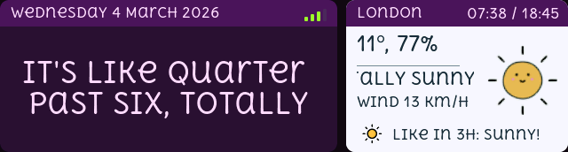
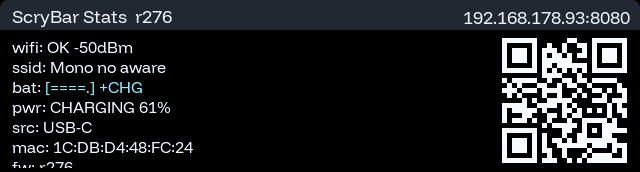
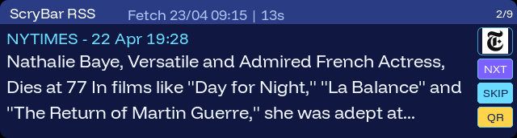
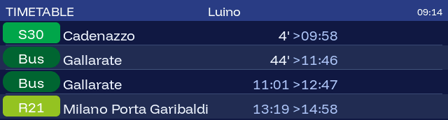
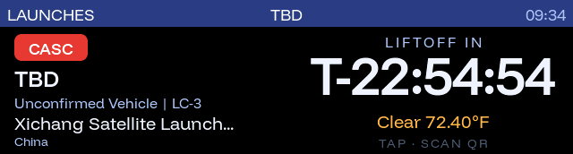
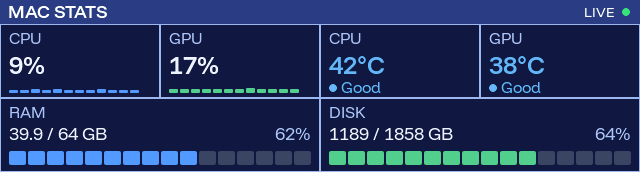
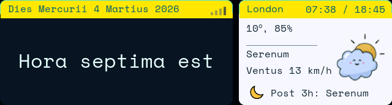
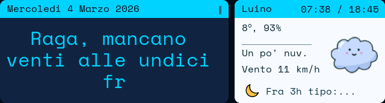
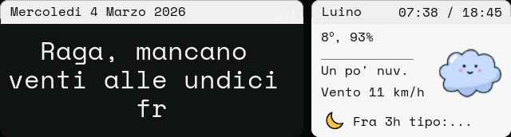

# ScryBar

[](https://arduino.cc/)
[](https://www.espressif.com/)
[](https://lvgl.io/)
[](#word-clock-languages)
[](#views)
[](#license)

**ScryBar** is an open-source ESP32-S3 desk companion. One 3.49" touchscreen, eight swipeable views, a word clock that composes real sentences in fourteen languages (from Italian and Latin to Klingon, 1337 Speak, Bellazio, and Pirate) — actual grammar, not uppercase tiles. Plus RSS, a Wikipedia deck, a `Now Playing` strip with cover art, a live public-transport timetable, a rocket launch countdown, a Mac Stats monitor driven by a macOS companion, and a LAN web config UI.

*Why "ScryBar"?* Part [scry](https://en.wikipedia.org/wiki/Scrying) (gazing into a surface to see things you shouldn't), part *scribe* (it writes sentences, not just numbers), part *bar* (look at it, it's a bar). A 640×172 strip that tells time in Klingon, fetches weather from an API you could just open yourself, scrolls headlines you already read on your phone, pulls Wikipedia facts nobody asked for, counts down rocket launches SpaceX will probably slip by three hours anyway, and shows the next train from the stop you already know by heart. On your desk. Between the coffee mug and the cable spaghetti. If that's not scrying, nothing is.

## HOME

<table><tr>
<td width="55%"></td>
<td>

**The default view.** A word clock that writes real sentences, not just numbers on a grid. Weather pulled live from Open-Meteo. Fourteen languages, seven themes, Funnel Display typography — all switchable from the web UI without reflashing.

</td>
</tr></table>

## INFO Panel

<table><tr>
<td width="55%"></td>
<td>

**The nervous system, exposed.** Wi-Fi signal, IP, MAC, battery level, firmware tag, NTP sync. The QR code points straight to the web config UI: scan it from your phone and you're in. Swipe right to get back to the interesting stuff.

</td>
</tr></table>

## AUX: RSS Feeds

<table><tr>
<td width="55%"></td>
<td>

**Your desk reads the news so you don't have to.** Up to five RSS feeds rotating on a timer, each headline paired with a live QR code. Tap `NXT` to skip ahead, `SKIP` to jump feeds, or scan the QR to read the full article on a screen that doesn't make your optometrist cry. Configurable from the web UI: pick your feeds, set the rotation, walk away.

</td>
</tr></table>

## WIKI: Wikipedia Stream

<table><tr>
<td width="55%"></td>
<td>

**A bottomless pit of trivia you never asked for.** Featured Article, On This Day, Random Article, all pulled from the Wikipedia API in eight selectable languages (independent from the system language, because maybe you want your clock in Klingon but your trivia in Portuguese). Same `SKIP`/`NXT`/`QR` controls. The kind of feature that makes you 20 minutes late to meetings and completely fine with it.

</td>
</tr></table>

## NOW PLAYING: macOS companion live feed

<table><tr>
<td width="55%"></td>
<td>

**What macOS is playing, on your desk.** Album art on the left, title and artist on the right, elapsed / duration, source tag (Music, Spotify, Podcasts, whatever). The [companion app](companion/mac/) sits in the menu bar, reads the system-wide `Now Playing` session through `MediaRemote.framework` (so it works with anything AVFoundation can see), and posts the metadata to `/api/now-playing` over your LAN. No API tokens, no OAuth dance.

</td>
</tr></table>

## TIMETABLE: live departures anywhere

<table><tr>
<td width="55%"></td>
<td>

**The LED sign at the stop, on your desk.** Live public-transport departures from any GTFS-indexed stop on Earth, powered by [Transitous](https://transitous.org) — no API key, no account, no rate limit. Type a station name in the web UI; autocomplete finds the Transitous stop ID. Colored line badges with adaptive font, real-time delay tags, arrival times, platform numbers. Adaptive countdown: `3'` / `14'` / `45'` for anything under an hour, `HH:MM` above, amber when the bus is arriving *now*. Twenty-plus countries confirmed working.

</td>
</tr></table>

## LAUNCHES: rocket countdown hero

<table><tr>
<td width="55%"></td>
<td>

**Know when SpaceX delays itself again.** Upcoming rocket launches from [The Space Devs](https://thespacedevs.com/) Launch Library 2. Cinematic T-minus hero with mission name, vehicle, pad location, and live weather at the site. Swipe once to see the next two missions in a compact row view. QR code jumps straight to the official mission page when you inevitably want to watch the stream.

</td>
</tr></table>

## MAC STATS: your Mac, on the desk

<table><tr>
<td width="55%"></td>
<td>

**Activity Monitor, but ambient.** CPU and GPU utilization with temperatures, RAM and disk usage bars, all pushed from the [ScryBar Companion](companion/mac/) menu-bar app every five seconds. Temperatures are color-coded (green / amber / red) and bars tint warm above 75% full. Works with Apple Silicon via the free [`macmon`](https://github.com/vladkens/macmon) helper (no `sudo` needed); Intel Macs fall back to IOKit SMC.

</td>
</tr></table>

## More Themes

| ScryBar Default | Cyberpunk 2077 | Tokyo Transit | Minimal Brutalist Mono |
|---|---|---|---|
|  |  |  |  |

> Yes, that is cyberpunk in Latin. If you want neon UI saying *Hora septima est*, ScryBar will not judge.

---

## Table of Contents

- [Hardware](#hardware)
- [Views](#views)
- [Word Clock Languages](#word-clock-languages)
- [How It Works](#how-it-works)
- [Quick Start](#quick-start)
- [Secrets](#secrets)
- [Feature Toggles](#feature-toggles)
- [Web Config (LAN)](#web-config-lan)
- [Serial Command Reference](#serial-command-reference)
- [Screenshot Workflow](#screenshot-workflow)
- [Security](#security)
- [Archive](#archive)
- [Acknowledgments](#acknowledgments)
- [Open Source Spirit](#open-source-spirit)
- [License](#license)

---

## Hardware

| Component | Spec | Role |
|---|---|---|
| **MCU** | ESP32-S3, 240 MHz, dual-core | The brain. 16 MB flash, OPI PSRAM in octal mode, because LVGL needs room to think. |
| **Board** | Waveshare ESP32-S3-Touch-LCD-3.49 | The whole stack in one unit: display, touch controller, IMU, power management, battery connector. |
| **Display** | AXS15231B, 3.49", 640×172 | The face. Horizontal strip format. `LV_COLOR_16_SWAP=1` because it expects RGB565 big-endian and is not open to discussion about this. |
| **Touch** | AXS15231B integrated | Single-point touch. Carefully filtered for ghost frames and sentinel coordinates. |
| **IMU** | QMI8658 6-axis | Accelerometer + gyroscope. Shake detection, tilt sensing. The bar knows when you're angry. |
| **Power** | USB-C + optional LiPo | Charging and battery fallback managed via TCA9554 GPIO expander. Always re-asserted at boot. |

The physical profile: a horizontal bar that sits flat on your desk. Wide enough to host eight views of mischief. Narrow enough that it stops pretending to be a monitor and commits to being furniture that has opinions.

---

## Views

Eight views, navigated by swipe. Any page can be toggled off from the web UI; the carousel compresses around what's left.

```
  INFO ◄─► HOME ◄─► AUX (RSS) ◄─► WIKI ◄─► NOW PLAYING ◄─► TIMETABLE ◄─► LAUNCHES ◄─► MAC STATS
```

**INFO** — System diagnostics: Wi-Fi status, RSSI, IP, MAC, battery level, power source, firmware build tag, NTP sync status. QR code pointing to the web config UI. The nervous system, exposed.

**HOME** — Word clock in natural sentence form (14 languages), weather icon, temperature, humidity. Theme-driven typography with auto-fit sizing. Themes switchable from the web UI without reflashing.

**AUX** — RSS feed rotation with up to 5 configurable sources. `SKIP`/`NXT`/`QR` controls. Every headline gets a live QR code, because sometimes you want to read the full article on a real screen, and that's fine.

**WIKI** — Wikipedia stream: Featured Article, On This Day, and Random Article. Language independently selectable (8 real languages) from the system language via web UI. Same `SKIP`/`NXT`/`QR` controls as AUX. A bottomless pit of trivia that you didn't need but now can't stop reading.

**NOW PLAYING** — Album art, title, artist, progress, source. The companion reads the system-wide `Now Playing` session through `MediaRemote.framework` and posts over LAN. One feed for Music, Spotify, TIDAL, podcasts, and whatever else macOS is already surfacing.

**TIMETABLE** — Live public-transport departures via [Transitous](https://transitous.org) (free global GTFS, no API key). Colored line badges, delays, arrival times, platform. Adaptive countdown: `3'` / `14'` / `45'` under the hour, `HH:MM` above. Handles trains, metro, trams, buses, coaches. Tap to peek at origin → terminus; destination filter via web UI. Twenty-plus countries confirmed.

**LAUNCHES** — Upcoming rocket launches from [The Space Devs](https://thespacedevs.com/) Launch Library 2. Cinematic T-minus hero, weather at the pad, QR jump to mission page. Second view shows the next two missions in a compact list.

**MAC STATS** — CPU and GPU load + temperatures, RAM and disk bars, pushed from the companion every five seconds. Color-coded above the thermal shrug zone. Needs the [macOS companion app](companion/mac/) running to be populated.

Physical buttons:

- `PWR` (center): short press toggles screensaver; hold `1.5s` for power-off (hard-off on battery via TCA9554, soft-off on USB); hold `1.5s` again to wake back to `HOME`.
- `BOOT` (left): single click jumps to `HOME`.
- `RST` (right): hardware reset. The nuclear option.

Auto-idle screensaver: `2h` on both USB and battery.

## Word Clock Languages

14 languages, all selectable from the web UI without reflashing. Setting persists to NVS.

**Creative & Constructed:**

| Code | Language | Example (3:15) |
|---|---|---|
| `bellazio` | Bellazio | *Raga, le tre e un quarto. For real.* |
| `val` | Valley Girl | *It's like quarter past three, totally* |
| `l33t` | 1337 Speak | *1T'5 QU4R73R P457 7HR33* |
| `sha` | Shakespearean English | *Verily, 'tis quarter past three* |
| `eo` | Esperanto | *estas kvarono post la tri* |
| `la` | Latina | *hora tertia et quadrans* |
| `tlh` | tlhIngan Hol (Klingon) | *wej rep wa'maH vagh tup* |
| `pir` | Pirate | *Shiver me timbers! Quarter past three!* |

**Modern Languages:**

| Code | Language | Example (3:15) |
|---|---|---|
| `en` | English | *it's quarter past three* |
| `it` | Italiano *(default)* | *sono le tre e un quarto* |
| `es` | Español | *son las tres y cuarto* |
| `fr` | Français | *il est trois heures et quart* |
| `de` | Deutsch | *es ist viertel nach drei* |
| `pt` | Português | *são três e quinze* |

Adding a language means writing 4 functions (word clock, weather short, weather label, date format) plus a `UiStrings` block and updating the dispatchers. The framework does the rest. If you can conjugate verbs, you can add a language.

---

## How It Works

At boot: assert SYS_EN via TCA9554, cycle Wi-Fi SSIDs (or use preferred SSID), fall back to setup AP if no known network, sync NTP, render HOME.

Serial `[SUMMARY]` every 30s: build tag, Wi-Fi, NTP, UI page, weather state. Read it like a flight data recorder.

Touch passes through anti-ghost filtering (AXS15231B produces spurious frames at idle; the controller has opinions about how often it wants to be touched).

---

## Quick Start

**Prerequisites:** `arduino-cli`, `esp32` board package by Espressif, libraries listed in `firmware_readme.md`.

### Compile

```bash
arduino-cli compile --clean \
  --build-path /tmp/arduino-build-scrybar \
  --fqbn esp32:esp32:esp32s3:UploadSpeed=921600,USBMode=hwcdc,CDCOnBoot=cdc,CPUFreq=240,FlashMode=qio,FlashSize=16M,PartitionScheme=custom,PSRAM=opi \
  .
```

### Upload

```bash
arduino-cli upload -p <PORT> \
  --fqbn esp32:esp32:esp32s3:UploadSpeed=921600,USBMode=hwcdc,CDCOnBoot=cdc,CPUFreq=240,FlashMode=qio,FlashSize=16M,PartitionScheme=custom,PSRAM=opi \
  --input-dir /tmp/arduino-build-scrybar \
  .
```

This repo ships a checked-in `partitions.csv` and uses `PartitionScheme=custom`.

If upload hangs on `Connecting...`, enter boot mode: hold `BOOT`, press and release `RST`, release `BOOT`. This is not a bug. It is a handshake.

Open Serial Monitor at **115200 baud**. You will see the boot banner, chip diagnostics, and (if `TEST_WIFI=1`) a connection attempt cycling through every configured SSID in sequence.

---

## Secrets

`secrets.h` is local-only and git-ignored. It holds Wi-Fi credentials and API keys.

```bash
cp secrets.h.example secrets.h
# fill in your credentials
```

`secrets.h.example` is committed and contains placeholders only (`<WIFI_SSID>`, `<API_KEY>`, etc.). Never put credentials in `config.h` or any versioned file. The `.gitignore` handles this by design, not accident.

---

## Feature Toggles

Enable or disable subsystems in `config.h`. Nothing is compiled in unless explicitly toggled on.

| Toggle | What it activates |
|---|---|
| `TEST_SERIAL_INFO` | Chip, heap, flash diagnostics at boot |
| `TEST_BACKLIGHT` | Display backlight PWM test |
| `TEST_I2C_SCAN` | I2C bus scan, prints found addresses |
| `TEST_DISPLAY` | Display init via AXS15231B (Arduino_GFX) |
| `TEST_IMU` | QMI8658 accelerometer + gyroscope |
| `TEST_WIFI` | STA connection with multi-SSID retry |
| `TEST_NTP` | NTP sync, prints `local_time=...` |
| `TEST_BATTERY` | Battery monitoring via ADC (voltage, charge level, power source) |
| `TEST_TOUCH` | **Required for swipe navigation.** Boot log shows `[SKIP] TEST_TOUCH=0` if disabled. |
| `DISPLAY_FLIP_180` | 180° rotation (USB-C left, speaker top). Default `1`. |
| `WEB_CONFIG_ENABLED` | LAN web config UI on port 8080 when Wi-Fi is connected. |

---

## Web Config (LAN)

When Wi-Fi is connected and `WEB_CONFIG_ENABLED=1`, ScryBar starts a lightweight HTTP server.

```
http://<DEVICE_IP>:8080
```

| Endpoint | Method | Does |
|---|---|---|
| `GET /` | | Config UI (Tron-grid themed, responsive, reduced-motion fallback) |
| `GET /api/config` | | Current config as JSON |
| `GET /api/wifi/scan` | | Scan nearby 2.4 GHz Wi-Fi networks (bounded timeout, safe in AP setup mode) |
| `GET /api/wifi/setup-qr.svg` | | SVG QR for setup URL (`http://192.168.4.1:8080` in AP mode) |
| `POST /api/config` | JSON body | Update config fields |
| `POST /config` | Form body | Update config via form UI |
| `POST /reload` | | Force refresh weather and RSS feeds |

Config persists to NVS. Configurable: Wi-Fi preferred SSID, Wi-Fi Direct mode, new Wi-Fi provisioning (scan + password), weather city/lat/lon, logo URL, up to 5 RSS feeds, system language, Wikipedia language, and UI theme.

### Wi-Fi Field Recovery

If no known network is reachable, setup AP starts (`ScryBar-Setup-XXXX`, 2.4 GHz). Join it and open `http://192.168.4.1:8080` to scan and provision a new network. The INFO panel shows a QR code pointing to the config URL; scan it with your phone and you're in.

---

## Serial Command Reference

Commands sent over Serial at 115200 baud. Case-insensitive.

**Navigation:**

| Command | Effect |
|---|---|
| `VIEW` | Toggle HOME ↔ AUX |
| `VIEWFIRST` | Jump to first main view (`HOME`, excludes INFO) |
| `VIEWLAST` | Jump to last main view |
| `VIEW0` / `VIEWINFO` | Force INFO page |
| `VIEW1` / `VIEWHOME` | Force HOME page |
| `VIEW2` / `VIEWAUX` / `VIEWRSS` | Force AUX/RSS page |
| `VIEW3` / `VIEWWIKI` | Force WIKI page |
| `VIEW4` / `VIEWNOW` / `VIEWNP` | Force NOW PLAYING page |
| `VIEW6` / `VIEWTRANSIT` / `TRANSIT` | Force TIMETABLE page |
| `VIEW7` / `VIEWLAUNCH` / `LAUNCH` | Force LAUNCHES page |
| `VIEW8` / `VIEWMACSTATS` / `MACSTATS` | Force MAC STATS page |

**Configuration:**

| Command | Effect |
|---|---|
| `LANG` | Print current language code |
| `LANG <code>` | Set language (e.g., `LANG tlh` for Klingon) |
| `THEME` | Print current theme ID |
| `THEME <id>` | Set UI theme |
| `QRON` / `QROFF` / `QRTOGGLE` | Show / hide / toggle QR codes on feed views |

**Diagnostics:**

| Command | Effect |
|---|---|
| `SNAP` / `SCREENSHOT` | Capture framebuffer as raw RGB565 over serial ([workflow below](#screenshot-workflow)) |
| `BATSTAT` | Print battery voltage, level, power source |
| `RSSSTAT` / `WIKISTAT` | Print RSS / Wikipedia feed status |
| `RSSDIAG` | Detailed RSS diagnostic (feed URLs, status, error counts) |
| `RELOAD` | Force refresh weather + RSS + Wiki feeds |
| `WEBCFG` | Print web config server status + URL |
| `WIFIDIRECT` | Print Wi-Fi Direct mode / AP status |
| `WIFIDIRECT off\|auto\|on` | Set Wi-Fi Direct mode and persist to NVS |

**Power & Screensaver:**

| Command | Effect |
|---|---|
| `SAVERON` / `SAVEROFF` | Force screensaver on / off |
| `SAVERSTAT` | Print screensaver state + active idle target |
| `PWROFF` | Soft power-off (recoverable via power button) |
| `PWROFFHARD` | Hard power-off. **Requires hardware power cycle. Handle with care.** |

A `[SUMMARY]` block is emitted automatically every 30 seconds: build, Wi-Fi, NTP, UI, and weather state. Read it like a flight data recorder.

---

## Screenshot Workflow

Capture live framebuffer snapshots over serial. Requires `ffmpeg` for the RGB565 → PNG conversion.

```bash
# Capture whatever is currently on screen
python3 tools/capture_snapshot.py --port <PORT> --out-dir screenshots

# Capture a specific view
python3 tools/capture_snapshot.py --port <PORT> --pre-cmd VIEWTIMETABLE --out-dir screenshots
# (TIMETABLE, VIEW6, and the legacy VIEWTRANSIT / TRANSIT aliases all work)
```

The `--pre-cmd` flag sends a serial command before taking the snapshot, useful for switching views without touching the device. Add `--pre-wait` and `--pre-gap` to tune boot / settle timing.

Wire format is `rgb565be`. Resolution is always `640×172`.

---

## Security

`secrets.h` is git-ignored and never committed. `secrets.h.example` is committed with placeholders only.

- **Never** commit `secrets.h`. The `.gitignore` has your back, but paranoia is a feature.
- If a secret ever lands in git history: rotate it immediately, then clean history.
- `config.h` and all versioned docs must remain credential-free. Always.

---

## Archive

The `archive/ansi/` directory contains the former ANSI/BBS art viewer: 27 embedded files from [Blocktronics](http://blocktronics.org/) and [Sixteen Colors](https://16colo.rs/), a full ANSI parser with SAUCE support, CGA palette, and CP437 rendering. Removed in r183 because the replay value of ten art files on a desk bar is approximately one afternoon. The code is fully intact with restoration instructions in `archive/ansi/README.md` if you disagree.

The ANSI parser was built with invaluable reference from **[icy_tools](https://github.com/mkrueger/icy_tools)** by Mike Krueger, the gold standard for ANSI art tooling. If you work with ANSI art on any platform, start there.

---

## Open Source Spirit

If you fork ScryBar, make it yours:

- swap feeds and weather locations,
- redesign views or add new ones,
- add a fourteenth language and send a PR,
- publish your variant and share improvements back.

Small screen. Wide horizon.

---

## License

Licensing for the repository as a whole is under review. The tree includes third-party code and assets with their own terms — notably the bundled PRBoom component under [`src/doom/prboom`](src/doom/prboom), whose GPL notice is in [`COPYING`](src/doom/prboom/COPYING). Until a root license and complete third-party notices are added, do not assume the entire repository is MIT-licensed.
Keep the copyright notice. No warranty. No liability. No hard feelings.

---

<div align="center">

*Built with Arduino, LVGL, too many filter constants, and the unwavering belief*
*that a word clock in Klingon on an ESP32 is objectively better than anything else on your desk.*

</div>
